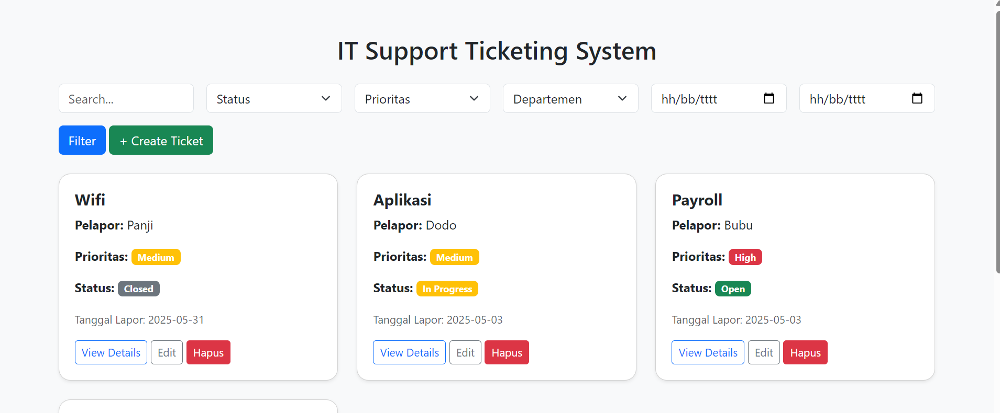

# 🛠️ IT Support Ticketing System

Sistem pelaporan sederhana masalah IT untuk area kantor. Aplikasi ini memudahkan tim untuk mencatat, melacak, dan mengelola laporan kerusakan perangkat atau sistem di lingkungan kerja.

---

## 📸 Screenshot

  
*Contoh tampilan dashboard modern dengan card view.*

---

## ✨ Fitur Utama

- ✅ Tambah tiket masalah secara cepat
- 📝 Edit dan update informasi tiket
- 🗑️ Hapus tiket dengan konfirmasi
- 📅 Tanggal input otomatis
- 🎨 Desain modern dengan Bootstrap (card view)

---


## 🛠️ Cara Instalasi

1. Clone repositori ini:

   ```bash
   git clone https://github.com/panjisetiadi12/ticketing-system.git
